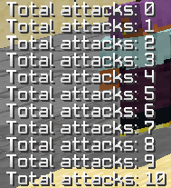
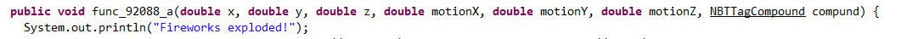
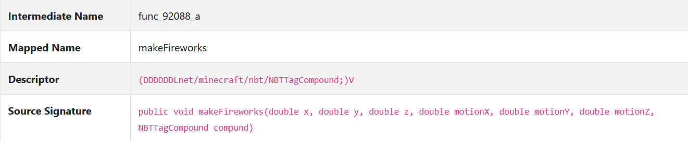

# ChatTriggers (2.2) ASM injection
[Original ASM injection guide](https://github.com/ChatTriggers/ChatTriggers/wiki/ASM-Injection)

# Introduction

ChatTriggers provides many useful features such as triggers and libraries like ChatLib. It also provides access to most of Forge's features by accessing their classes and subscribing to normal Forge events.
While you can do a lot with these features, you might want to do something that was not intended or designed before. You can do some of these, like making custom events for chat messages, but eventually you might have to modify game code to achieve your goals.

Although ASM is powerful, try not to use it at all. It can be both risky (and produce weird code) and needs a game restart when other people want to install your module. It can also be frustrating and risky for your sanity.

## How it goes

LaunchWrapper is a system that Mojang made to fix code in older versions of Minecraft without changing the game itself. It provides a tweaker system, which can do numerous things. Most importantly it gives tweak authors the ability to transform raw classes (byte arrays).
```java
public byte[] transform(String name, String transformedName, byte[] basicClass);
```
Forge uses a Tweaker to load and also gives this transformation ability to mods with loading plugins. ChatTriggers uses this to add some custom events (such as the `messageSent` event) using the [ASMHelper library](https://github.com/ChatTriggers/ChatTriggers/wiki/ASM-Injection). It also gives us the ability to transform classes (although more limited) with the context of this library.

# Now we go

Normal module code is ran somewhat early when Minecraft starts. However, since we need to transform classes, ASM entry code needs to run earlier. Since we run before any of Minecraft starts we cannot access any of it's code or our module's code directly.

In your `metadata.json`, add an asmEntry as such (replace `asm.js` with whatever file name you need):
```json
    "asmEntry": "asm.js" 
```
Then, make the new `asm.js` file:
```js
export default ASM => {

}
```
The `ASM` object is the ASM lib we use for adding injections and also contains references to some useful class names we might need.
Yyou can try running some code in this ASM function.
```js
export default ASM => {
    const System = Java.type("java.lang.System");
    System.out.println("Hello ASM world!");
}
```
`
[00:37:33] [main/INFO] [STDOUT]: [sun.reflect.NativeMethodAccessorImpl:invoke0:-2]: Hello ASM world!
`
This code runs early and it can be useful in some cases (?) but we want to modify classes. The most powerful class modification is modifying method bodies with our own bytecode but for now, let's make some more simple modifications. 

## Adding new fields

```js
export default ASM => {
    const {AccessType} = ASM; // the ASM object has many useful variables and such

    const className = "net/minecraft/client/Minecraft";
    const fieldName = "attacks";
    const fieldDescriptor = "I":
    const accessType = AccessType.PUBLIC;

    const initialValue = 0;

    ASM.fieldBuilder(
        className,
        fieldName,
        fieldDescriptor,
        accessType
    ).
    initialValue(initialValue).
    execute();
}
```

The `className` is the full name of the class we add the field to, with `/`'s instead of `.`'s for package seperators.
The `fieldName` is the name of the field. 
The `fieldDescriptor` is the descriptor of the field. You can learn more about field descriptors [here](https://docs.oracle.com/javase/specs/jvms/se17/html/jvms-4.html#jvms-4.3.2) with some more information below. In this case the field is an integer, so the descriptor is a simple `I`.
The `accessType` is a custom ASMHelper enum. This should always be `PUBLIC` but it could also be `PRIVATE` or `PROTECTED` if you want (why).

The `initialValue` is what the field originally starts as.

`execute` must be called after all builders or else the code won't take effect.

Now we can use the field `attacks` as we would use any other field in the Minecraft class.
```js
register("attackEntity", () => {
    Client.getMinecraft().attacks ++;
    ChatLib.chat("Total attacks: " + Client.getMinecraft().attacks);	
})
```


## Modfying existing methods

```js
export default ASM => {
    const className = "net/minecraft/client/multiplayer/WorldClient";
    const methodName = "makeFireworks";
    const methodDescriptor = "(DDDDDDLnet/minecraft/nbt/NBTTagCompound;)V";
    const injectionPoint = ASM.At(ASM.At.HEAD);

    ASM.injectBuilder(
        className,
        methodName,
        methodDescriptor,
        injectionPoint
    ).
    methodMaps({
        func_92088_a: "makeFireworks",
        makeFireworks: "func_92088_a"
    }).
    instructions($ => {
        addInstructions($);
    }).
    execute();
}

function addInstructions($) {
    $.
    getStatic("java/lang/System", "out", "Ljava/io/PrintStream;").
    ldc("Fireworks exploded!").
    invokeVirtual("java/io/PrintStream", "println", "(Ljava/lang/String;)V");
}
```

There are 2 things here that are noticeably different from building new fields.
First is the `methodMaps` method. This allows us to specify mappings for methods, both ones that we want to call within the ASM instructions and the method we want to target.
Second is the `instructions` method. This method takes a callback accepting an instruction builder which we call $ for a short name.
This guide is not going to cover how JVM bytecode works, but know that the $ takes methods from ASMHelper's [insnList](https://github.com/FalseHonesty/AsmHelper/blob/master/src/main/kotlin/dev/falsehonesty/asmhelper/dsl/instructions/insnList.kt) which has similar names to bytecode instructions. It also uses a Proxy to add a special method: `invokeJS`.

Now we can see "Fireworks exploded!" in standard output whenever a firework explodes in the world.
`
[13:09:56] [Client thread/INFO] [STDOUT]: [net.minecraft.client.multiplayer.WorldClient:func_92088_a:-1]: makeFireworks called!
`

### Calling module code

In normal bytecode manipulation you can call your own methods with invoke operations. However, our modules aren't made in Java and aren't loaded normally. ChatTriggers adds an `invokeJS` function to call certain specified functions.
Before calling invokeJS, you must have an Object array on the stack. All JS methods take an object array as the parameter and return an Object.

Since there is nothing similar to `import` in bytecode, ChatTriggers has to know which methods we want to call.

In your `metadata.json`, add the following entry:
```json
    "asmExposedFunctions": {
        "asmFunction": "asmFunction.js"
    }
```

Then, make the file `asmFunction.js`:
```js
export default () => {
    ChatLib.chat("makeFireworks called!");
}
```
Now for the ASM:
```js
function addInstructions($) {
    $.
    iconst_0().
    anewarray("java/lang/Object").
    invokeJS("asmFunction");
}
```

Now we have access to the module and ChatTriggers APIs.


Note that you can make multiple exposed functions, although they have to be in different files. These functions can be reloaded but the ASM calling it cannot.

Adding parameters:

```js
function addInstructions($) {
    $.
    array(3, "java/lang/Object", $ => {
        $.
        aadd($ => {
            $.
            dload(1). // x
            invokeStatic("java/lang/Double", "valueOf", "(D)Ljava/lang/Double;");
        });
        $.
        aadd($ => {
            $.
            dload(3). // y
            invokeStatic("java/lang/Double", "valueOf", "(D)Ljava/lang/Double;");
        });
        $.
        aadd($ => {
            $.
            dload(5). // z
            invokeStatic("java/lang/Double", "valueOf", "(D)Ljava/lang/Double;");
        });
    }).
    invokeJS("asmFunction");
}
```

The method `makeFireworks` has a signature of `(DDDDDDLnet/minecraft/nbt/NBTTagCompound)`. We want the first 3 doubles (x, y, z) from the parameters. We don't start at 0 though, because that is the reference to the `this` object (in non-static methods). After each double on the stack seems to be a `double_2nd` value so we go by values of 2.


Using invokeJS returns an Object. This is whatever you return in your exposed function, which is `org.mozilla.javascript.Undefined` if you don't return anything. Make sure to cast your Object to another type to properly use return values.

### Class modifications

ASMHelper can be helpful for some things but other times we may want to directly modify the class instead of just fields or methods. Using the `modify` function, we receive a general modification helper object, which is documented [here](https://github.com/FalseHonesty/AsmHelper/blob/master/src/main/kotlin/dev/falsehonesty/asmhelper/dsl/writers/GeneralModificationWriter.kt#L22). Note that modifying the class like this means you are on your own, without invokeJS or mappings.
```js
export default ASM => {
    const className = "net/minecraft/client/Minecraft";
    
    ASM.modify(
        className,
        modifier => {
            const methods = modifier.classNode.methods;
            methods.toArray().forEach(method => {
                java.lang.System.out.println(`method.name: ${method.name}`);
            });
        }
    );
}
```

`
[14:51:31] [main/INFO] [STDOUT]: [sun.reflect.NativeMethodAccessorImpl:invoke0:-2]: method.name: <init>
[14:51:31] [main/INFO] [STDOUT]: [sun.reflect.NativeMethodAccessorImpl:invoke0:-2]: method.name: a
[14:51:31] [main/INFO] [STDOUT]: [sun.reflect.NativeMethodAccessorImpl:invoke0:-2]: method.name: am
[14:51:31] [main/INFO] [STDOUT]: [sun.reflect.NativeMethodAccessorImpl:invoke0:-2]: method.name: an
[14:51:31] [main/INFO] [STDOUT]: [sun.reflect.NativeMethodAccessorImpl:invoke0:-2]: method.name: ao
[14:51:31] [main/INFO] [STDOUT]: [sun.reflect.NativeMethodAccessorImpl:invoke0:-2]: method.name: ap
[14:51:31] [main/INFO] [STDOUT]: [sun.reflect.NativeMethodAccessorImpl:invoke0:-2]: method.name: aq
[14:51:31] [main/INFO] [STDOUT]: [sun.reflect.NativeMethodAccessorImpl:invoke0:-2]: method.name: ar
`

# Tips

## Export your code

LaunchWrapper provides system properties that we can use to export class files and see our code in effect.
Add the following to your JVM arguments:
```
-Dlegacy.debugClassLoading=true
-Dlegacy.debugClassLoadingSave=true
```
After the classes you target have loaded, they will be saved in folders in the Minecraft directory starting with `CLASSLOADER_TEMP`. These will not save if you have more than 10 of them, so make sure to delete the folders often. 


## Use [mcp.thiakil.com](mcp.thiakil.com) for method descriptors

Method descriptors can sometimes be confusing, but this MCP website has descriptors for all methods.


